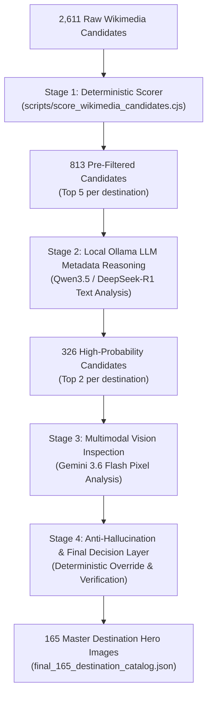

# GlobeTrotter — Multi-Model Image Selection Architecture

> **Document Version:** 1.0 (Production Architecture Design)  
> **Status:** APPROVED  
> **Target Scope:** 165 Master Catalog Destinations  
> **Primary Goal:** Select the SINGLE BEST, most visually representative hero image for each destination from 2,611 verified Wikimedia Commons candidates while minimizing API cost and enforcing strict anti-hallucination guardrails.  

---

## 1. Executive Architecture Overview

GlobeTrotter's multi-model image selection pipeline combines **zero-cost deterministic rule filtering**, **local text-based LLM metadata reasoning (Ollama)**, and **targeted multimodal Vision inspection (Gemini)**.

Instead of naively sending 2,611 raw images to expensive Vision APIs, the architecture employs a 4-stage funnel:



---

## 2. Model Responsibility Matrix

| Model / Service | Input Type | Role | Why | API Cost | Bulk / Selective | Required? |
| :--- | :---: | :--- | :--- | :---: | :---: | :---: |
| **Deterministic Scorer** | Structured Metadata | **CORE** | Instant keyword, resolution, aspect ratio, and metadata completeness scoring. | **$0.00** | Bulk (2,611 candidates) | **YES** |
| **Qwen3.5:9b (Ollama Local)** | Text Metadata + Profile | **CORE** | Fast local LLM reasoning over titles/descriptions against visual profiles; flags suspicious keywords. | **$0.00** | Selective (813 candidates) | **YES** |
| **DeepSeek-R1:8b (Ollama Local)** | Text Metadata + Profile | **SPECIALIST** | Deep reasoning & tiebreaker for ambiguous metadata edge cases. | **$0.00** | Selective (Edge Cases) | **OPTIONAL** |
| **Gemini 3.6 Flash** | Image Bytes + Profile | **CORE** | Actual pixel-level visual inspection; detects paintings, text signboards, craft close-ups, and bad framing. | **Free Tier / Low Cost** | Highly Selective (326 candidates) | **YES** |
| **Perplexity** | Text Query | **SPECIALIST** | Fact-checking ambiguous landmark names or disputed regional geography. | **External API** | On-Demand (Unknown Landmarks) | **OPTIONAL** |
| **Claude** | Vision / Text | **SPECIALIST** | Reserved as an elite tiebreaker for unresolved destination hero conflicts. | **High Token Cost** | Ultra-Selective (<10 items) | **OPTIONAL** |
| **ChatGPT (GPT-4o)** | Text / Vision | **SPECIALIST** | Secondary verification for complex heritage architecture classification. | **External API** | Ultra-Selective (<10 items) | **OPTIONAL** |
| **Grok** | Web / Text | **NOT USEFUL** | Redundant for structured metadata filtering; provides no unique pixel-inspection capabilities over Gemini. | **N/A** | N/A | **NO** |
| **NotebookLM** | Document Synthesis | **NOT USEFUL** | Unnecessary because authoritative visual profiles (`destination_visual_profiles.json`) are already compiled. | **N/A** | N/A | **NO** |

---

## 3. Candidate Reduction Funnel & Budget Estimates

```text
2,611 Raw Candidates
   ↓ (Stage 1: Deterministic Metadata Scorer)
813 Top-5 Pre-Filtered Candidates (gemini_review_queue.json)
   ↓ (Stage 2: Local Qwen3.5 Metadata Reasoning)
326 Top-2 High-Probability Candidates
   ↓ (Stage 3: Gemini 3.6 Flash Multimodal Pixel Inspection)
163 Selected Primary Destination Hero Images
   ↓ (Stage 4: Deterministic Anti-Hallucination Validation)
165 Master Catalog Destination Hero Images (2 fallback destinations handled safely)
```

### Call Budget Estimates for 165 Master Destinations:
* **Deterministic Computations:** 2,611 (Zero API cost)
* **Local Ollama LLM Queries:** 813 text queries (**$0.00 cost**, ~0.5s per query locally)
* **Gemini Vision Image Requests:** 326 total requests (2 per destination).
  - *Daily Free Tier Management:* 20 requests/day limit $\rightarrow$ Can execute in daily batches of 20 or via quota upgrade/model switching (`gemini-2.5-flash` / `gemini-1.5-flash`).
* **Final URL Output Count:** Exactly 165 hero image URLs.

---

## 4. Text-Based Reasoning vs. Visual Understanding

### A. Text-Based Reasoning (Local Qwen3.5 / DeepSeek-R1)
Can evaluate **only textual metadata**:
* Filename & title semantic matching against landmark keywords.
* Spotting obvious negative title keywords (*embroidery, fabric, souvenir, sign, logo, map, diagram, coin, stamp*).
* Comparing metadata completeness (artist, license, original resolution).
* **Limitation:** Cannot see image pixels. A file named `City Palace Udaipur.jpg` showing a textile close-up will fool text-only models.

### B. Visual Understanding (Gemini 3.6 Flash)
Evaluates **actual image pixels**:
* Detecting whether an image is a photograph or a painting/sketch/diagram.
* Detecting whether an image is a close-up signboard, text placard, or craft product.
* Evaluating visual framing, contrast, atmospheric lighting, and horizon alignment.
* Verifying that the claimed primary landmark (e.g. *Amber Fort*) is actually visible in the photograph.

---

## 5. Anti-Hallucination & Security Design

To prevent LLMs or Vision APIs from hallucinating non-existent URLs or broken paths:

1. **ID-Based Selection Only:** AI models are **never permitted to emit URLs**. The prompt supplies candidates labeled by 0-indexed candidate IDs (`cand_0`, `cand_1`, `cand_2`). The AI response must return only candidate IDs.
2. **Deterministic URL Resolution:** The final image URL, thumbnail URL, license, and artist metadata are pulled deterministically from [`research/images/wikimedia_candidates.json`](file:///c:/VScode/GlobeTrotter_Hackathon/research/images/wikimedia_candidates.json) using the selected candidate ID.
3. **URL Validation Gate:** Before saving to the production catalog, the candidate's HTTP `imageUrl` is validated via a `HEAD` request to ensure 200 OK availability.

---

## 6. Deterministic Decision & Override Logic

The final candidate ranking combines all stages using a deterministic formula:

$$\text{Final Score} = \text{Deterministic Score} (30\%) + \text{Local LLM Metadata Score} (20\%) + \text{Gemini Vision Score} (50\%) + \text{Vision Override}$$

### Override Rules:
1. **Vision `REJECT` Authority:** If Gemini Vision assigns `decision: "REJECT"` to a candidate (e.g. painting, text sign, craft close-up), its score is instantly set to `0`, overruling high metadata scores.
2. **Vision `STRONG` Preference:** If Gemini Vision rates an image `decision: "STRONG"` and `landmarkMatch >= 18/20`, it automatically wins over a candidate with higher metadata resolution but weaker visual composition.
3. **Zero-Candidate Fallback:** If all 5 candidates for a destination receive `REJECT` from Gemini Vision, the destination status is set to `NO_ACCEPTABLE_CANDIDATE` and falls back to static app image utilities (`imageUtils.ts`).

---

## 7. Failure & Graceful Fallback Design

| Failure Scenario | Automatic Pipeline Fallback Behavior |
| :--- | :--- |
| **Gemini Quota Exhausted (HTTP 429)** | Pause batch queue; fall back safely to Stage 1 Deterministic Scorer winner for pending destinations. |
| **Candidate Image Download Fails (HTTP 404/500)** | Skip failed candidate and evaluate next candidate in queue. |
| **Malformed AI Response / Invalid JSON** | Re-parse using JSON extraction regex; if parsing fails, fallback to candidate rank #1. |
| **All Candidates Rated `REJECT`** | Mark `status = "NO_ACCEPTABLE_CANDIDATE"`, `bestImage = null`. |
| **Zero Candidates Found (e.g. #71, #114)** | Mark `status = "NO_CANDIDATES"`, `bestImage = null` (Schema compliant). |

---

## 8. Recommended Implementation Roadmap

1. **Step 1 (Completed):** 165 Master Catalog & Visual Profiles Frozen ([`destination_visual_profiles.json`](file:///c:/VScode/GlobeTrotter_Hackathon/research/images/destination_visual_profiles.json)).
2. **Step 2 (Completed):** Stage 1 Review Queue Generated ([`gemini_review_queue.json`](file:///c:/VScode/GlobeTrotter_Hackathon/research/images/gemini_review_queue.json) - 813 candidates).
3. **Step 3 (Next):** Implement Local Qwen3.5 Ollama Metadata Pre-filter script (`scripts/filter_queue_with_ollama.cjs`) to narrow 813 candidates down to 326 top candidates.
4. **Step 4:** Execute Gemini Vision Pixel Evaluation script (`scripts/run_gemini_vision_full.cjs`) with batching and rate-limit backoff.
5. **Step 5:** Generate final production dataset [`research/images/final_165_destination_images.json`](file:///c:/VScode/GlobeTrotter_Hackathon/research/images/final_165_destination_images.json).
